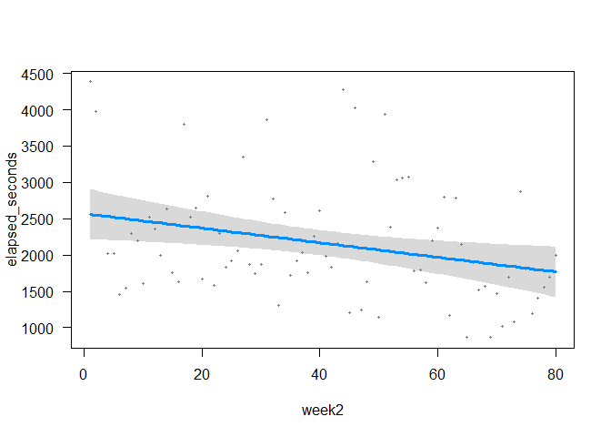

NYT Crosswords Analysis
================
Angelina Sassi
5/11/2021

I’ve been playing the New York Times crossword consistently since July
2019, and I want to confirm my hypothesis that I’m improving over time.
I downloaded my NYT Crossword data thanks to [this code developed by
Matt Dodge (thanks,
Matt\!)](https://github.com/mattdodge/nyt-crossword-stats). In my first
adventure with GitHub and Python, I added the variable `solve_date` to
the CSV output using the code fork
[https://github.com/angiesassi/nyt-crossword-stats](here). Props and
many thanks to Ari and Ed for their Python assistance\!

``` r
#library(reticulate)
#source_python("fetch_puzzle_stats_as.py")
```

``` r
library(tidyverse)
data <- read_csv("data.csv")

#remove dates with unsolved puzzles
data <- data %>% 
  filter(elapsed_seconds != 0) %>% 
  filter(solved == 1)

#adjust date format of solve_date
data$solve_date <- as.Date(data$solve_date, format = "%Y-%d-%m")

#check that the data are correct
data$solve_date[data$date == '2020-04-30']
```

    ## [1] "2021-05-11"

``` r
#remove outliers (Thursday 2019-07-25 and Saturday 2019-09-14 (Rex Parker did it in 6:49, there's no way I beat him without copying someone else...))
data <- data[-c(5),]
data <- data[-c(55),]
```

``` r
data$day <- factor(data$day, levels = c("Mon", "Tue", "Wed", "Thu", "Fri", "Sat", "Sun"))

ggplot(data, aes(x=day, y=elapsed_seconds, fill = day))+
  geom_boxplot()+
  labs(title = "NYT Crossword Solve Time in Seconds by Day of the Week", x = "Day of the Week", y="Solve Time (Seconds)")
```

<!-- -->

``` r
knitr::kable(data %>% 
  group_by("Day of the Week" = day) %>% 
  summarize("Fastest Time (in min.)" = round(min(elapsed_seconds)/60,2), "Average Time" = round(mean(elapsed_seconds)/60,2), "Std. dev." = round(sd(elapsed_seconds)/60,2)))
```

| Day of the Week | Fastest Time (in min.) | Average Time | Std. dev. |
| :-------------- | ---------------------: | -----------: | --------: |
| Mon             |                   5.25 |         9.84 |      4.27 |
| Tue             |                   6.22 |        15.77 |      7.32 |
| Wed             |                   8.63 |        22.47 |     11.89 |
| Thu             |                  12.23 |        35.06 |     13.18 |
| Fri             |                  14.38 |        36.07 |     13.50 |
| Sat             |                  14.82 |        37.75 |     12.52 |
| Sun             |                  18.48 |        60.68 |     19.87 |

``` r
#add a "week" variable based on puzzle date
data_Mon <- data %>% 
  filter(day == "Mon") %>% 
  mutate(week = c(1:nrow(data %>% filter(day=="Mon"))))

data_Tue <- data %>% 
  filter(day == "Tue") %>% 
  mutate(week = c(1:nrow(data %>% filter(day=="Tue"))))

data_Wed <- data %>% 
  filter(day == "Wed") %>% 
  mutate(week = c(1:nrow(data %>% filter(day=="Wed"))))

data_Thu <- data %>% 
  filter(day == "Thu") %>% 
  mutate(week = c(1:nrow(data %>% filter(day=="Thu"))))

data_Fri <- data %>% 
  filter(day == "Fri") %>% 
  mutate(week = c(1:nrow(data %>% filter(day=="Fri"))))

data_Sat <- data %>% 
  filter(day == "Sat") %>% 
  mutate(week = c(1:nrow(data %>% filter(day=="Sat"))))

data_Sun <- data %>% 
  filter(day == "Sun") %>% 
  mutate(week = c(1:nrow(data %>% filter(day=="Sun"))))

data <- rbind(data_Mon, data_Tue, data_Wed, data_Thu, data_Fri, data_Sat, data_Sun)
```

``` r
ggplot(data, aes(x=elapsed_seconds, fill = day))+
  geom_histogram()+
  facet_wrap(~day)+
  ggtitle("Histograms of Solve Time by Puzzle Day")
```

<!-- -->

``` r
p1<-ggplot(data, aes(x=week, y=elapsed_seconds, color=day))+
  geom_line()+
  geom_smooth(method="lm", se=FALSE)+
  ggtitle("Solve Time by Puzzle Day over time (weeks)")

p1
```

<!-- -->

Average solve time appears to decrease as the date the puzzle was
published increases, with the sharpest decreases among Sunday puzzles.

# Modeling

## Simple linear model

``` r
model1 <- lm(elapsed_seconds ~ week, data=data)
summary(model1)
```

    ## 
    ## Call:
    ## lm(formula = elapsed_seconds ~ week, data = data)
    ## 
    ## Residuals:
    ##     Min      1Q  Median      3Q     Max 
    ## -2027.3  -879.2  -219.4   587.2  5081.1 
    ## 
    ## Coefficients:
    ##             Estimate Std. Error t value Pr(>|t|)    
    ## (Intercept) 2365.441     98.134    24.1  < 2e-16 ***
    ## week         -13.124      2.083    -6.3 6.02e-10 ***
    ## ---
    ## Signif. codes:  0 '***' 0.001 '**' 0.01 '*' 0.05 '.' 0.1 ' ' 1
    ## 
    ## Residual standard error: 1158 on 562 degrees of freedom
    ## Multiple R-squared:  0.06596,    Adjusted R-squared:  0.0643 
    ## F-statistic: 39.69 on 1 and 562 DF,  p-value: 6.021e-10

## Random intercepts model + diagnostics

``` r
model2 <- lmer(elapsed_seconds ~ week + (1|day), data=data)
summary(model2)
```

    ## Linear mixed model fit by REML. t-tests use Satterthwaite's method [
    ## lmerModLmerTest]
    ## Formula: elapsed_seconds ~ week + (1 | day)
    ##    Data: data
    ## 
    ## REML criterion at convergence: 9021.9
    ## 
    ## Scaled residuals: 
    ##     Min      1Q  Median      3Q     Max 
    ## -3.0563 -0.5752 -0.1172  0.3813  4.7970 
    ## 
    ## Random effects:
    ##  Groups   Name        Variance Std.Dev.
    ##  day      (Intercept) 990370   995.2   
    ##  Residual             502563   708.9   
    ## Number of obs: 564, groups:  day, 7
    ## 
    ## Fixed effects:
    ##             Estimate Std. Error       df t value Pr(>|t|)    
    ## (Intercept) 2295.762    380.915    6.230   6.027  0.00082 ***
    ## week         -10.554      1.279  556.046  -8.251 1.15e-15 ***
    ## ---
    ## Signif. codes:  0 '***' 0.001 '**' 0.01 '*' 0.05 '.' 0.1 ' ' 1
    ## 
    ## Correlation of Fixed Effects:
    ##      (Intr)
    ## week -0.137

``` r
df <- data
df$res <- model2@resp$wtres

ggplot(df, aes(x=res))+
  geom_histogram()+
  xlab(expression(epsilon))+
  ggtitle("Histogram of Random Intercept Model Errors")
```

<!-- -->

``` r
ggplot(df, aes(sample=res))+
  stat_qq()+
  geom_qq_line()+
  ggtitle("Q-Q Plot of Random Intercept Model Errors")
```

<!-- -->

``` r
df$fitted <- fitted(model2)

ggplot(df, aes(x=fitted,y=res))+
  geom_point()+
  ylab(expression(epsilon))+
  ggtitle("Scatterplot of Residuals vs. Fitted")
```

<!-- -->

## Random slopes and intercepts model

``` r
model3 <- lmer(elapsed_seconds ~ week + (1+day|day), data=data)
summary(model3)
```

    ## Linear mixed model fit by REML. t-tests use Satterthwaite's method [
    ## lmerModLmerTest]
    ## Formula: elapsed_seconds ~ week + (1 + day | day)
    ##    Data: data
    ## 
    ## REML criterion at convergence: 9011.7
    ## 
    ## Scaled residuals: 
    ##     Min      1Q  Median      3Q     Max 
    ## -3.0662 -0.5743 -0.1081  0.3774  4.7882 
    ## 
    ## Random effects:
    ##  Groups   Name        Variance Std.Dev. Corr                               
    ##  day      (Intercept) 2384918  1544.3                                      
    ##           dayTue       156237   395.3   -0.92                              
    ##           dayWed       800621   894.8   -0.92  0.98                        
    ##           dayThu      2384918  1544.3   -1.00  0.92  0.92                  
    ##           dayFri      2384950  1544.3   -1.00  0.92  0.92  1.00            
    ##           daySat      2346310  1531.8   -1.00  0.92  0.92  1.00  1.00      
    ##           daySun       867156   931.2   -0.40  0.22  0.21  0.40  0.40  0.39
    ##  Residual              501742   708.3                                      
    ## Number of obs: 564, groups:  day, 7
    ## 
    ## Fixed effects:
    ##             Estimate Std. Error       df t value Pr(>|t|)    
    ## (Intercept) 2593.190     68.793   19.017   37.70  < 2e-16 ***
    ## week         -10.610      1.277  558.958   -8.31 7.29e-16 ***
    ## ---
    ## Signif. codes:  0 '***' 0.001 '**' 0.01 '*' 0.05 '.' 0.1 ' ' 1
    ## 
    ## Correlation of Fixed Effects:
    ##      (Intr)
    ## week -0.741
    ## convergence code: 0
    ## boundary (singular) fit: see ?isSingular

## Summary of Results (AIC and BIC)

``` r
AIC(model1, model2, model3)
```

    ##        df      AIC
    ## model1  3 9562.263
    ## model2  4 9029.933
    ## model3 31 9073.654

``` r
BIC(model1, model2, model3)
```

    ##        df      BIC
    ## model1  3 9575.269
    ## model2  4 9047.274
    ## model3 31 9208.041

# Does ordering puzzles by the date I solved them make a difference in the goodness of fit?

``` r
#sort by solved date
data <- data[order(data$solve_date),]

#add "week2" variable (chronological order of solved date)
data_Mon <- data %>% 
  filter(day == "Mon") %>% 
  mutate(week2 = c(1:nrow(data %>% filter(day=="Mon"))))

data_Tue <- data %>% 
  filter(day == "Tue") %>% 
  mutate(week2 = c(1:nrow(data %>% filter(day=="Tue"))))

data_Wed <- data %>% 
  filter(day == "Wed") %>% 
  mutate(week2 = c(1:nrow(data %>% filter(day=="Wed"))))

data_Thu <- data %>% 
  filter(day == "Thu") %>% 
  mutate(week2 = c(1:nrow(data %>% filter(day=="Thu"))))

data_Fri <- data %>% 
  filter(day == "Fri") %>% 
  mutate(week2 = c(1:nrow(data %>% filter(day=="Fri"))))

data_Sat <- data %>% 
  filter(day == "Sat") %>% 
  mutate(week2 = c(1:nrow(data %>% filter(day=="Sat"))))

data_Sun <- data %>% 
  filter(day == "Sun") %>% 
  mutate(week2 = c(1:nrow(data %>% filter(day=="Sun"))))

data2 <- rbind(data_Mon, data_Tue, data_Wed, data_Thu, data_Fri, data_Sat, data_Sun)

p2<-ggplot(data2, aes(x=week2, y=elapsed_seconds, color=day))+ 
  geom_line()+ 
  geom_smooth(method="lm", se=FALSE)+
  ggtitle("Solve Time by Puzzle Day over time (weeks)")

p1
```

<!-- -->

``` r
p2
```

<!-- -->

The two “week” variables don’t appear to differ that much. Let’s see
whether models based on the `week2` variable have better fits.

## Simple linear model

``` r
model4 <- lm(elapsed_seconds ~ week2, data=data2)
summary(model4)
```

    ## 
    ## Call:
    ## lm(formula = elapsed_seconds ~ week2, data = data2)
    ## 
    ## Residuals:
    ##     Min      1Q  Median      3Q     Max 
    ## -1868.5  -844.5  -252.2   647.3  5037.8 
    ## 
    ## Coefficients:
    ##             Estimate Std. Error t value Pr(>|t|)    
    ## (Intercept) 2413.391     97.485  24.757  < 2e-16 ***
    ## week2        -14.297      2.069  -6.909 1.33e-11 ***
    ## ---
    ## Signif. codes:  0 '***' 0.001 '**' 0.01 '*' 0.05 '.' 0.1 ' ' 1
    ## 
    ## Residual standard error: 1151 on 562 degrees of freedom
    ## Multiple R-squared:  0.07828,    Adjusted R-squared:  0.07664 
    ## F-statistic: 47.73 on 1 and 562 DF,  p-value: 1.33e-11

## Random intercepts model

``` r
model5 <- lmer(elapsed_seconds ~ week2 + (1|day), data=data2)
summary(model5)
```

    ## Linear mixed model fit by REML. t-tests use Satterthwaite's method [
    ## lmerModLmerTest]
    ## Formula: elapsed_seconds ~ week2 + (1 | day)
    ##    Data: data2
    ## 
    ## REML criterion at convergence: 9005.6
    ## 
    ## Scaled residuals: 
    ##     Min      1Q  Median      3Q     Max 
    ## -3.0621 -0.6211 -0.1170  0.3913  4.8091 
    ## 
    ## Random effects:
    ##  Groups   Name        Variance Std.Dev.
    ##  day      (Intercept) 986610   993.3   
    ##  Residual             488047   698.6   
    ## Number of obs: 564, groups:  day, 7
    ## 
    ## Fixed effects:
    ##             Estimate Std. Error       df t value Pr(>|t|)    
    ## (Intercept) 2343.908    380.072    6.225   6.167 0.000726 ***
    ## week2        -11.734      1.261  556.045  -9.309  < 2e-16 ***
    ## ---
    ## Signif. codes:  0 '***' 0.001 '**' 0.01 '*' 0.05 '.' 0.1 ' ' 1
    ## 
    ## Correlation of Fixed Effects:
    ##       (Intr)
    ## week2 -0.135

``` r
df3 <- data2
df3$res <- model5@resp$wtres

ggplot(df3, aes(x=res))+
  geom_histogram()+
  xlab(expression(epsilon))+
  ggtitle("Histogram of Random Intercept Model Errors")
```

<!-- -->

``` r
ggplot(df3, aes(sample=res))+
  stat_qq()+
  geom_qq_line()+
  ggtitle("Q-Q Plot of Random Intercept Model Errors")
```

<!-- -->

``` r
df3$fitted <- fitted(model5)

ggplot(df3, aes(x=fitted,y=res))+
  geom_point()+
  ylab(expression(epsilon))+
  ggtitle("Scatterplot of Residuals vs. Fitted")
```

<!-- -->

## Random slopes and intercepts model

``` r
model6 <- lmer(elapsed_seconds ~ week2 + (1+day|day), data=data2)
summary(model6)
```

    ## Linear mixed model fit by REML. t-tests use Satterthwaite's method [
    ## lmerModLmerTest]
    ## Formula: elapsed_seconds ~ week2 + (1 + day | day)
    ##    Data: data2
    ## 
    ## REML criterion at convergence: 8995.2
    ## 
    ## Scaled residuals: 
    ##     Min      1Q  Median      3Q     Max 
    ## -3.0721 -0.6142 -0.1154  0.3861  4.8005 
    ## 
    ## Random effects:
    ##  Groups   Name        Variance Std.Dev. Corr                               
    ##  day      (Intercept) 2349617  1532.8                                      
    ##           dayTue       258635   508.6   -0.76                              
    ##           dayWed      1860783  1364.1   -0.85  0.45                        
    ##           dayThu      2349366  1532.8   -1.00  0.76  0.85                  
    ##           dayFri      2350019  1533.0   -1.00  0.76  0.85  1.00            
    ##           daySat      2349417  1532.8   -1.00  0.76  0.85  1.00  1.00      
    ##           daySun       253530   503.5   -0.31 -0.27  0.70  0.31  0.31  0.31
    ##  Residual              487214   698.0                                      
    ## Number of obs: 564, groups:  day, 7
    ## 
    ## Fixed effects:
    ##             Estimate Std. Error       df t value Pr(>|t|)    
    ## (Intercept) 2640.966     67.637  191.013   39.05   <2e-16 ***
    ## week2        -11.789      1.258  559.084   -9.37   <2e-16 ***
    ## ---
    ## Signif. codes:  0 '***' 0.001 '**' 0.01 '*' 0.05 '.' 0.1 ' ' 1
    ## 
    ## Correlation of Fixed Effects:
    ##       (Intr)
    ## week2 -0.743
    ## convergence code: 0
    ## boundary (singular) fit: see ?isSingular

## Summary of All Results (AIC and BIC)

``` r
AIC(model1, model2, model3, model4, model5, model6)
```

    ##        df      AIC
    ## model1  3 9562.263
    ## model2  4 9029.933
    ## model3 31 9073.654
    ## model4  3 9554.776
    ## model5  4 9013.614
    ## model6 31 9057.225

``` r
BIC(model1, model2, model3, model4, model5, model6)
```

    ##        df      BIC
    ## model1  3 9575.269
    ## model2  4 9047.274
    ## model3 31 9208.041
    ## model4  3 9567.781
    ## model5  4 9030.954
    ## model6 31 9191.612

``` r
summary(model5)
```

    ## Linear mixed model fit by REML. t-tests use Satterthwaite's method [
    ## lmerModLmerTest]
    ## Formula: elapsed_seconds ~ week2 + (1 | day)
    ##    Data: data2
    ## 
    ## REML criterion at convergence: 9005.6
    ## 
    ## Scaled residuals: 
    ##     Min      1Q  Median      3Q     Max 
    ## -3.0621 -0.6211 -0.1170  0.3913  4.8091 
    ## 
    ## Random effects:
    ##  Groups   Name        Variance Std.Dev.
    ##  day      (Intercept) 986610   993.3   
    ##  Residual             488047   698.6   
    ## Number of obs: 564, groups:  day, 7
    ## 
    ## Fixed effects:
    ##             Estimate Std. Error       df t value Pr(>|t|)    
    ## (Intercept) 2343.908    380.072    6.225   6.167 0.000726 ***
    ## week2        -11.734      1.261  556.045  -9.309  < 2e-16 ***
    ## ---
    ## Signif. codes:  0 '***' 0.001 '**' 0.01 '*' 0.05 '.' 0.1 ' ' 1
    ## 
    ## Correlation of Fixed Effects:
    ##       (Intr)
    ## week2 -0.135

Model 5 – random intercepts with solved week as the explanatory variable
– has the best fit. According to Model 5, I decrease my average puzzle
solve time by -11.734 seconds each week.

# Models for each day of the week because I’m compulsive

``` r
fitmon <- lm(elapsed_seconds ~ week2, data=filter(data2, day=="Mon"))
fittue <- lm(elapsed_seconds ~ week2, data=filter(data2, day=="Tue"))
fitwed <- lm(elapsed_seconds ~ week2, data=filter(data2, day=="Wed"))
fitthu <- lm(elapsed_seconds ~ week2, data=filter(data2, day=="Thu"))
fitfri <- lm(elapsed_seconds ~ week2, data=filter(data2, day=="Fri"))
fitsat <- lm(elapsed_seconds ~ week2, data=filter(data2, day=="Sat"))
fitsun <- lm(elapsed_seconds ~ week2, data=filter(data2, day=="Sun"))

tbl_mon <- tbl_regression(fitmon, intercept=TRUE)
tbl_tue <- tbl_regression(fittue, intercept=TRUE)
tbl_wed <- tbl_regression(fitwed, intercept=TRUE)
tbl_thu <- tbl_regression(fitthu, intercept=TRUE)
tbl_fri <- tbl_regression(fitfri, intercept=TRUE)
tbl_sat <- tbl_regression(fitsat, intercept=TRUE)
tbl_sun <- tbl_regression(fitsun, intercept=TRUE)

tbl_merge(tbls = list(tbl_mon, tbl_tue, tbl_wed, tbl_thu, tbl_fri, tbl_sat, tbl_sun), tab_spanner=c("**Mon**", "**Tue**", "**Wed**", "**Thu**", "**Fri**", "**Sat**", "**Sun**"))
```

<style>html {
  font-family: -apple-system, BlinkMacSystemFont, 'Segoe UI', Roboto, Oxygen, Ubuntu, Cantarell, 'Helvetica Neue', 'Fira Sans', 'Droid Sans', Arial, sans-serif;
}

#jqzfzsducp .gt_table {
  display: table;
  border-collapse: collapse;
  margin-left: auto;
  margin-right: auto;
  color: #333333;
  font-size: 16px;
  font-weight: normal;
  font-style: normal;
  background-color: #FFFFFF;
  width: auto;
  border-top-style: solid;
  border-top-width: 2px;
  border-top-color: #A8A8A8;
  border-right-style: none;
  border-right-width: 2px;
  border-right-color: #D3D3D3;
  border-bottom-style: solid;
  border-bottom-width: 2px;
  border-bottom-color: #A8A8A8;
  border-left-style: none;
  border-left-width: 2px;
  border-left-color: #D3D3D3;
}

#jqzfzsducp .gt_heading {
  background-color: #FFFFFF;
  text-align: center;
  border-bottom-color: #FFFFFF;
  border-left-style: none;
  border-left-width: 1px;
  border-left-color: #D3D3D3;
  border-right-style: none;
  border-right-width: 1px;
  border-right-color: #D3D3D3;
}

#jqzfzsducp .gt_title {
  color: #333333;
  font-size: 125%;
  font-weight: initial;
  padding-top: 4px;
  padding-bottom: 4px;
  border-bottom-color: #FFFFFF;
  border-bottom-width: 0;
}

#jqzfzsducp .gt_subtitle {
  color: #333333;
  font-size: 85%;
  font-weight: initial;
  padding-top: 0;
  padding-bottom: 4px;
  border-top-color: #FFFFFF;
  border-top-width: 0;
}

#jqzfzsducp .gt_bottom_border {
  border-bottom-style: solid;
  border-bottom-width: 2px;
  border-bottom-color: #D3D3D3;
}

#jqzfzsducp .gt_col_headings {
  border-top-style: solid;
  border-top-width: 2px;
  border-top-color: #D3D3D3;
  border-bottom-style: solid;
  border-bottom-width: 2px;
  border-bottom-color: #D3D3D3;
  border-left-style: none;
  border-left-width: 1px;
  border-left-color: #D3D3D3;
  border-right-style: none;
  border-right-width: 1px;
  border-right-color: #D3D3D3;
}

#jqzfzsducp .gt_col_heading {
  color: #333333;
  background-color: #FFFFFF;
  font-size: 100%;
  font-weight: normal;
  text-transform: inherit;
  border-left-style: none;
  border-left-width: 1px;
  border-left-color: #D3D3D3;
  border-right-style: none;
  border-right-width: 1px;
  border-right-color: #D3D3D3;
  vertical-align: bottom;
  padding-top: 5px;
  padding-bottom: 6px;
  padding-left: 5px;
  padding-right: 5px;
  overflow-x: hidden;
}

#jqzfzsducp .gt_column_spanner_outer {
  color: #333333;
  background-color: #FFFFFF;
  font-size: 100%;
  font-weight: normal;
  text-transform: inherit;
  padding-top: 0;
  padding-bottom: 0;
  padding-left: 4px;
  padding-right: 4px;
}

#jqzfzsducp .gt_column_spanner_outer:first-child {
  padding-left: 0;
}

#jqzfzsducp .gt_column_spanner_outer:last-child {
  padding-right: 0;
}

#jqzfzsducp .gt_column_spanner {
  border-bottom-style: solid;
  border-bottom-width: 2px;
  border-bottom-color: #D3D3D3;
  vertical-align: bottom;
  padding-top: 5px;
  padding-bottom: 6px;
  overflow-x: hidden;
  display: inline-block;
  width: 100%;
}

#jqzfzsducp .gt_group_heading {
  padding: 8px;
  color: #333333;
  background-color: #FFFFFF;
  font-size: 100%;
  font-weight: initial;
  text-transform: inherit;
  border-top-style: solid;
  border-top-width: 2px;
  border-top-color: #D3D3D3;
  border-bottom-style: solid;
  border-bottom-width: 2px;
  border-bottom-color: #D3D3D3;
  border-left-style: none;
  border-left-width: 1px;
  border-left-color: #D3D3D3;
  border-right-style: none;
  border-right-width: 1px;
  border-right-color: #D3D3D3;
  vertical-align: middle;
}

#jqzfzsducp .gt_empty_group_heading {
  padding: 0.5px;
  color: #333333;
  background-color: #FFFFFF;
  font-size: 100%;
  font-weight: initial;
  border-top-style: solid;
  border-top-width: 2px;
  border-top-color: #D3D3D3;
  border-bottom-style: solid;
  border-bottom-width: 2px;
  border-bottom-color: #D3D3D3;
  vertical-align: middle;
}

#jqzfzsducp .gt_from_md > :first-child {
  margin-top: 0;
}

#jqzfzsducp .gt_from_md > :last-child {
  margin-bottom: 0;
}

#jqzfzsducp .gt_row {
  padding-top: 8px;
  padding-bottom: 8px;
  padding-left: 5px;
  padding-right: 5px;
  margin: 10px;
  border-top-style: solid;
  border-top-width: 1px;
  border-top-color: #D3D3D3;
  border-left-style: none;
  border-left-width: 1px;
  border-left-color: #D3D3D3;
  border-right-style: none;
  border-right-width: 1px;
  border-right-color: #D3D3D3;
  vertical-align: middle;
  overflow-x: hidden;
}

#jqzfzsducp .gt_stub {
  color: #333333;
  background-color: #FFFFFF;
  font-size: 100%;
  font-weight: initial;
  text-transform: inherit;
  border-right-style: solid;
  border-right-width: 2px;
  border-right-color: #D3D3D3;
  padding-left: 12px;
}

#jqzfzsducp .gt_summary_row {
  color: #333333;
  background-color: #FFFFFF;
  text-transform: inherit;
  padding-top: 8px;
  padding-bottom: 8px;
  padding-left: 5px;
  padding-right: 5px;
}

#jqzfzsducp .gt_first_summary_row {
  padding-top: 8px;
  padding-bottom: 8px;
  padding-left: 5px;
  padding-right: 5px;
  border-top-style: solid;
  border-top-width: 2px;
  border-top-color: #D3D3D3;
}

#jqzfzsducp .gt_grand_summary_row {
  color: #333333;
  background-color: #FFFFFF;
  text-transform: inherit;
  padding-top: 8px;
  padding-bottom: 8px;
  padding-left: 5px;
  padding-right: 5px;
}

#jqzfzsducp .gt_first_grand_summary_row {
  padding-top: 8px;
  padding-bottom: 8px;
  padding-left: 5px;
  padding-right: 5px;
  border-top-style: double;
  border-top-width: 6px;
  border-top-color: #D3D3D3;
}

#jqzfzsducp .gt_striped {
  background-color: rgba(128, 128, 128, 0.05);
}

#jqzfzsducp .gt_table_body {
  border-top-style: solid;
  border-top-width: 2px;
  border-top-color: #D3D3D3;
  border-bottom-style: solid;
  border-bottom-width: 2px;
  border-bottom-color: #D3D3D3;
}

#jqzfzsducp .gt_footnotes {
  color: #333333;
  background-color: #FFFFFF;
  border-bottom-style: none;
  border-bottom-width: 2px;
  border-bottom-color: #D3D3D3;
  border-left-style: none;
  border-left-width: 2px;
  border-left-color: #D3D3D3;
  border-right-style: none;
  border-right-width: 2px;
  border-right-color: #D3D3D3;
}

#jqzfzsducp .gt_footnote {
  margin: 0px;
  font-size: 90%;
  padding: 4px;
}

#jqzfzsducp .gt_sourcenotes {
  color: #333333;
  background-color: #FFFFFF;
  border-bottom-style: none;
  border-bottom-width: 2px;
  border-bottom-color: #D3D3D3;
  border-left-style: none;
  border-left-width: 2px;
  border-left-color: #D3D3D3;
  border-right-style: none;
  border-right-width: 2px;
  border-right-color: #D3D3D3;
}

#jqzfzsducp .gt_sourcenote {
  font-size: 90%;
  padding: 4px;
}

#jqzfzsducp .gt_left {
  text-align: left;
}

#jqzfzsducp .gt_center {
  text-align: center;
}

#jqzfzsducp .gt_right {
  text-align: right;
  font-variant-numeric: tabular-nums;
}

#jqzfzsducp .gt_font_normal {
  font-weight: normal;
}

#jqzfzsducp .gt_font_bold {
  font-weight: bold;
}

#jqzfzsducp .gt_font_italic {
  font-style: italic;
}

#jqzfzsducp .gt_super {
  font-size: 65%;
}

#jqzfzsducp .gt_footnote_marks {
  font-style: italic;
  font-size: 65%;
}
</style>
<div id="jqzfzsducp" style="overflow-x:auto;overflow-y:auto;width:auto;height:auto;"><table class="gt_table">
  
  <thead class="gt_col_headings">
    <tr>
      <th class="gt_col_heading gt_center gt_columns_bottom_border" rowspan="2" colspan="1"><strong>Characteristic</strong></th>
      <th class="gt_center gt_columns_top_border gt_column_spanner_outer" rowspan="1" colspan="3">
        <span class="gt_column_spanner"><strong>Mon</strong></span>
      </th>
      <th class="gt_center gt_columns_top_border gt_column_spanner_outer" rowspan="1" colspan="3">
        <span class="gt_column_spanner"><strong>Tue</strong></span>
      </th>
      <th class="gt_center gt_columns_top_border gt_column_spanner_outer" rowspan="1" colspan="3">
        <span class="gt_column_spanner"><strong>Wed</strong></span>
      </th>
      <th class="gt_center gt_columns_top_border gt_column_spanner_outer" rowspan="1" colspan="3">
        <span class="gt_column_spanner"><strong>Thu</strong></span>
      </th>
      <th class="gt_center gt_columns_top_border gt_column_spanner_outer" rowspan="1" colspan="3">
        <span class="gt_column_spanner"><strong>Fri</strong></span>
      </th>
      <th class="gt_center gt_columns_top_border gt_column_spanner_outer" rowspan="1" colspan="3">
        <span class="gt_column_spanner"><strong>Sat</strong></span>
      </th>
      <th class="gt_center gt_columns_top_border gt_column_spanner_outer" rowspan="1" colspan="3">
        <span class="gt_column_spanner"><strong>Sun</strong></span>
      </th>
    </tr>
    <tr>
      <th class="gt_col_heading gt_columns_bottom_border gt_center" rowspan="1" colspan="1"><strong>Beta</strong></th>
      <th class="gt_col_heading gt_columns_bottom_border gt_center" rowspan="1" colspan="1"><strong>95% CI</strong><sup class="gt_footnote_marks">1</sup></th>
      <th class="gt_col_heading gt_columns_bottom_border gt_center" rowspan="1" colspan="1"><strong>p-value</strong></th>
      <th class="gt_col_heading gt_columns_bottom_border gt_center" rowspan="1" colspan="1"><strong>Beta</strong></th>
      <th class="gt_col_heading gt_columns_bottom_border gt_center" rowspan="1" colspan="1"><strong>95% CI</strong><sup class="gt_footnote_marks">1</sup></th>
      <th class="gt_col_heading gt_columns_bottom_border gt_center" rowspan="1" colspan="1"><strong>p-value</strong></th>
      <th class="gt_col_heading gt_columns_bottom_border gt_center" rowspan="1" colspan="1"><strong>Beta</strong></th>
      <th class="gt_col_heading gt_columns_bottom_border gt_center" rowspan="1" colspan="1"><strong>95% CI</strong><sup class="gt_footnote_marks">1</sup></th>
      <th class="gt_col_heading gt_columns_bottom_border gt_center" rowspan="1" colspan="1"><strong>p-value</strong></th>
      <th class="gt_col_heading gt_columns_bottom_border gt_center" rowspan="1" colspan="1"><strong>Beta</strong></th>
      <th class="gt_col_heading gt_columns_bottom_border gt_center" rowspan="1" colspan="1"><strong>95% CI</strong><sup class="gt_footnote_marks">1</sup></th>
      <th class="gt_col_heading gt_columns_bottom_border gt_center" rowspan="1" colspan="1"><strong>p-value</strong></th>
      <th class="gt_col_heading gt_columns_bottom_border gt_center" rowspan="1" colspan="1"><strong>Beta</strong></th>
      <th class="gt_col_heading gt_columns_bottom_border gt_center" rowspan="1" colspan="1"><strong>95% CI</strong><sup class="gt_footnote_marks">1</sup></th>
      <th class="gt_col_heading gt_columns_bottom_border gt_center" rowspan="1" colspan="1"><strong>p-value</strong></th>
      <th class="gt_col_heading gt_columns_bottom_border gt_center" rowspan="1" colspan="1"><strong>Beta</strong></th>
      <th class="gt_col_heading gt_columns_bottom_border gt_center" rowspan="1" colspan="1"><strong>95% CI</strong><sup class="gt_footnote_marks">1</sup></th>
      <th class="gt_col_heading gt_columns_bottom_border gt_center" rowspan="1" colspan="1"><strong>p-value</strong></th>
      <th class="gt_col_heading gt_columns_bottom_border gt_center" rowspan="1" colspan="1"><strong>Beta</strong></th>
      <th class="gt_col_heading gt_columns_bottom_border gt_center" rowspan="1" colspan="1"><strong>95% CI</strong><sup class="gt_footnote_marks">1</sup></th>
      <th class="gt_col_heading gt_columns_bottom_border gt_center" rowspan="1" colspan="1"><strong>p-value</strong></th>
    </tr>
  </thead>
  <tbody class="gt_table_body">
    <tr>
      <td class="gt_row gt_left">(Intercept)</td>
      <td class="gt_row gt_center">814</td>
      <td class="gt_row gt_center">717, 911</td>
      <td class="gt_row gt_center"><0.001</td>
      <td class="gt_row gt_center">1,371</td>
      <td class="gt_row gt_center">1,210, 1,532</td>
      <td class="gt_row gt_center"><0.001</td>
      <td class="gt_row gt_center">1,965</td>
      <td class="gt_row gt_center">1,690, 2,240</td>
      <td class="gt_row gt_center"><0.001</td>
      <td class="gt_row gt_center">2,438</td>
      <td class="gt_row gt_center">2,096, 2,781</td>
      <td class="gt_row gt_center"><0.001</td>
      <td class="gt_row gt_center">2,570</td>
      <td class="gt_row gt_center">2,219, 2,921</td>
      <td class="gt_row gt_center"><0.001</td>
      <td class="gt_row gt_center">2,839</td>
      <td class="gt_row gt_center">2,521, 3,157</td>
      <td class="gt_row gt_center"><0.001</td>
      <td class="gt_row gt_center">4,509</td>
      <td class="gt_row gt_center">4,006, 5,013</td>
      <td class="gt_row gt_center"><0.001</td>
    </tr>
    <tr>
      <td class="gt_row gt_left">week2</td>
      <td class="gt_row gt_center">-5.2</td>
      <td class="gt_row gt_center">-7.2, -3.2</td>
      <td class="gt_row gt_center"><0.001</td>
      <td class="gt_row gt_center">-10</td>
      <td class="gt_row gt_center">-13, -6.7</td>
      <td class="gt_row gt_center"><0.001</td>
      <td class="gt_row gt_center">-15</td>
      <td class="gt_row gt_center">-20, -9.0</td>
      <td class="gt_row gt_center"><0.001</td>
      <td class="gt_row gt_center">-8.1</td>
      <td class="gt_row gt_center">-15, -0.90</td>
      <td class="gt_row gt_center">0.028</td>
      <td class="gt_row gt_center">-10</td>
      <td class="gt_row gt_center">-18, -2.5</td>
      <td class="gt_row gt_center">0.010</td>
      <td class="gt_row gt_center">-15</td>
      <td class="gt_row gt_center">-23, -7.9</td>
      <td class="gt_row gt_center"><0.001</td>
      <td class="gt_row gt_center">-23</td>
      <td class="gt_row gt_center">-34, -11</td>
      <td class="gt_row gt_center"><0.001</td>
    </tr>
  </tbody>
  
  <tfoot>
    <tr class="gt_footnotes">
      <td colspan="22">
        <p class="gt_footnote">
          <sup class="gt_footnote_marks">
            <em>1</em>
          </sup>
           
          CI = Confidence Interval
          <br />
        </p>
      </td>
    </tr>
  </tfoot>
</table></div>

My largest improvement each week is -23 seconds for Sunday puzzles,
followed by Wednesday and Saturday (Wednesday has a slightly tighter
confidence interval).

### Visregs

``` r
visreg(fitmon)
```

<!-- -->

``` r
visreg(fittue)
```

<!-- -->

``` r
visreg(fitwed)
```

<!-- -->

``` r
visreg(fitthu)
```

<!-- -->

``` r
visreg(fitfri)
```

<!-- -->

``` r
visreg(fitsat)
```

<!-- -->

``` r
visreg(fitsun)
```

<!-- -->

### Linear Regression Diagnostics

``` r
autoplot(fitmon)
```

<!-- -->

``` r
autoplot(fittue)
```

<!-- -->

``` r
autoplot(fitwed)
```

<!-- -->

``` r
autoplot(fitthu)
```

<!-- -->

``` r
autoplot(fitfri)
```

<!-- -->

``` r
autoplot(fitsat)
```

<!-- -->

``` r
autoplot(fitsun)
```

<!-- -->
